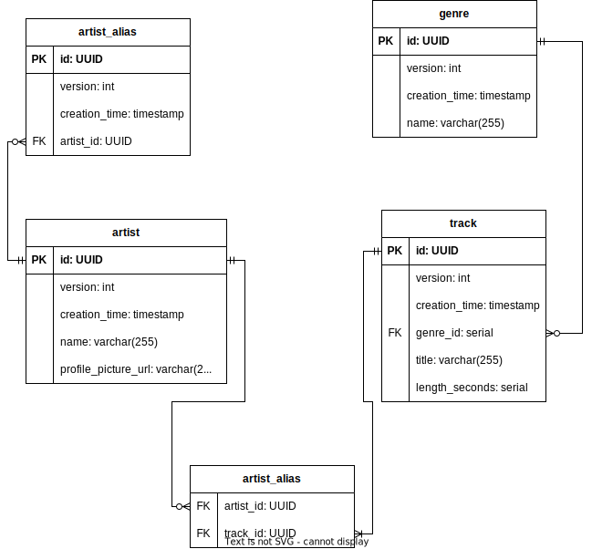

# Decisions & Assumptions

#### Author: Dan McElroy
#### Last updated: 20th November 2023

### Project Scope

From the provided [requirements](requirements.md) I decided to product a backend solution only - the requirements make 
mention of a homepage, but this could be developed separately as a client of this API.

The API provides a REST interface, with Create, Read, Update and Delete operations for tracks, artists and genres.

### API Design

The API is mainly concerned with three resources: `track`, `genre` and `artist`. Each of these resources can be
interacted with in the following ways:
* `GET /<resource>/<id>`: get one resource with the given ID
* `PATCH /<resource>/<id>`: update any number of fields within the resource
* `DELETE /<resource>/<id>`: delete the resource and any dependent resources
* `PUT /<resource>` create a new resource

The `artist` resource has an additional endpoint, `/artist/today`, which returns the "Artist of the Day", a rotating
selection of artists as described in the [requirements document](requirements.md)

There are limitations to this approach in terms of flexibility, though this is discussed further in 
[Next Steps](next-steps.md).

### Data Model

The data model is fairly straightforward given the requirements of the project, with a couple of notable exceptions:
- Genre as Object
  - At the beginning of the project I was tempted to keep `genre` as a simple `varchar` within a `user`, but decided
  to upgrade it to a separate entity, both to keep the option open to extend a genre's metadata in the future and to
  allow for broader querying options (i.e. allowing users to find all tracks with a certain genre).
- Multiple artists per track
  - I decided to implement the `track`-`artist` relationship as many-to-many, to reflect the not-uncommon situation 
  where artists collaborate on a track and a "primary" or "main" artist isn't clear. 

In the future, it would be nice to extend this data model to include a `release` entity to group tracks by their release
in an album, EP, single or compilation. Additionally, adding a `deleted` column to all entities to allow for "soft
deletion" would likely be a good idea.

### Tech Stack

As the only purely technical requirement was to use a JVM language, I settled on a Java Spring Boot WebFlux API,
drawing on my recent experience and my preference for reactive programming.

The backing database is a PostgreSQL instance, primarily managed via Hibernate Reactive with migrations controlled by
Flyway. For local development, this database was deployed as a `postgres` Docker container via Docker Compose.

The Docker Compose file also includes configuration for a Sonarqube instance, which works in combination with JaCoCo to
give code quality and test coverage feedback.

### Artist of the Day Implementation

The goals of "Artist of the Day" are to provide a consistent Artist result for each request that rotates through
all Artists in the store, once per day.

To achieve this, we take the following steps:
- Find the number of days since the time of the user's request and a fixed date in history
(currently using the "Unix Epoch", aka. January 1st 1970)
- Find the number of artists currently in the database, and use a [modulo](https://en.wikipedia.org/wiki/Modulo)
operation to get a usable index _N_ for our daily Artist (expressed as `daysSinceEpoch % numberOfArtists`)
- Order the artist table by its `creation_time` property (as a non-optional, immutable and easily comparable value,
which has been indexed for optimisation purposes)
- Retrieve the _Nth_ artist from the ordered table.

One slight limitation of this approach from a performance perspective is that it currently uses two separate database
sessions, one to retrieve the number of artists and another to retrieve the Nth artist, but this allows us to keep the
business logic in the service layer of the application and out of the low-level database access code without serious
refactoring.

### Architecture

Throughout development I strove to maintain a clean separation of application layers loosely defined as _User
interface_, _Business logic_ and _Data access_ with data flowing in one direction - ensuring that the details of the
data access layer (primarily made up of `DboRepository` and `Dbo` classes) are not exposed to the business logic layer
(achieved by dependency injection and a second, more abstract layer of `Repository` interfaces). Ideally this would be
verified and preserved by architectural unit tests (see [Next Steps](next-steps.md#expand-automated-testing)).

### Limitations
Unfortunately, at the time of writing the application's functionality is limited due to unresolved issues with the data
access layer, discussed [below](current-issues.md). Diagnosing and attempting to resolve this issue took precedence 
over resolving other important yet non-critical issues with the design and implementation, described below:
- Parameter checking is inconsistently applied - sometimes 
- Currently the application has no security configuration, and every endpoint is open for all users.
- Error handling isn't ideal at the moment - currently all errors are returned to the user as an `ErrorDto` with a
limited amount of information, but the range of described errors should be extended and at the same time, this
functionality should be able to be optionally disabled while in development environments to aid with debugging.

Further issues and ideas for how to resolve them can be found [here](next-steps.md).